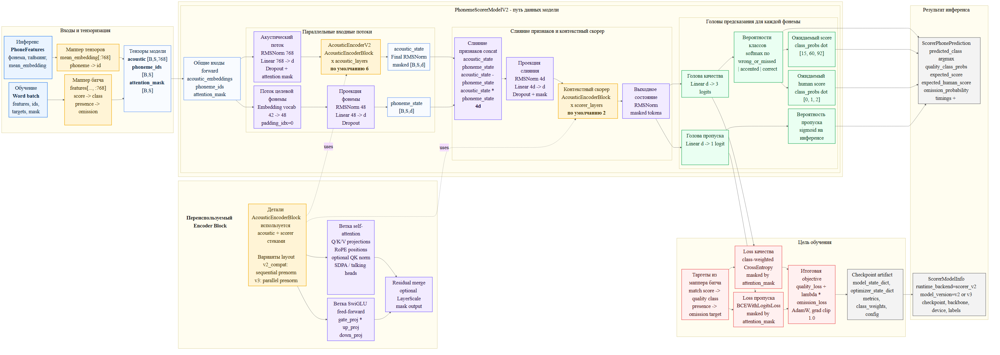

# Архитектура PhonemeScorerModelV2

Этот документ описывает схему `PhonemeScorerModelV2`: как данные подготавливаются, проходят через модель, как устроены основные блоки скорера, какие выходы формируются на инференсе и какие loss-функции используются при обучении.

Схема на русском языке:



Исходник схемы Mermaid: `scorer_v2_model_architecture_a4_ru.mmd`.

## Общий поток данных

Модель работает с последовательностью фонем слова. Для каждой позиции в последовательности она получает акустическое представление, идентификатор целевой фонемы и маску валидных токенов. После этого модель объединяет акустическую информацию и информацию о целевой фонеме, прогоняет результат через контекстный скорер и формирует предсказания качества произношения и вероятности пропуска.

Главная идея схемы: `AcousticEncoderBlock` является переиспользуемым строительным блоком. Он применяется в двух местах:

- в `AcousticEncoderV2`, который кодирует акустический поток;
- в `Contextual scorer`, который обрабатывает уже объединенные акустические и фонемные признаки.

Пунктирные стрелки `uses` на схеме показывают именно это переиспользование.

## Входы и тензоризация

Блок `Inputs and Tensorization` показывает два режима подготовки данных.

`Runtime PhoneFeatures` используется на инференсе. Вход содержит фонему, тайминги и `mean_embedding`. `Tensor mapper` берет первые 768 признаков из `mean_embedding` и переводит фонему в числовой `id`.

`Training Word batch` используется при обучении. Батч содержит признаки, идентификаторы, таргеты и маску. `Batch mapper` подготавливает акустические признаки `features[..., :768]`, переводит score в класс качества и presence в таргет пропуска.

Оба пути сходятся в `Model tensors`:

- `acoustic [B,S,768]` - акустические эмбеддинги для каждой позиции;
- `phoneme_ids [B,S]` - числовые идентификаторы целевых фонем;
- `attention_mask [B,S]` - маска валидных токенов.

Здесь `B` означает batch size, `S` - длину последовательности фонем, `d` - внутреннюю размерность модели.

## PhonemeScorerModelV2

`PhonemeScorerModelV2` принимает общие входы forward:

- `acoustic_embeddings`;
- `phoneme_ids`;
- `attention_mask`.

Дальше модель разделяет обработку на два параллельных входных потока: акустический поток и поток целевой фонемы.

## Акустический поток

`Acoustic stream` нормализует входные акустические эмбеддинги через `RMSNorm 768`, проецирует их из 768 признаков во внутреннюю размерность `d`, применяет `Dropout` и учитывает `attention_mask`.

После этого данные проходят через `AcousticEncoderV2`. Этот модуль состоит из нескольких `AcousticEncoderBlock`; на схеме указано значение по умолчанию: `acoustic_layers = 6`.

Результат акустического потока - `acoustic_state`. Он проходит финальный `RMSNorm` и маскируется по `attention_mask`, чтобы padding-позиции не влияли на дальнейшие вычисления.

## Поток целевой фонемы

`Target phoneme stream` переводит `phoneme_ids` в обучаемые эмбеддинги. Размер словаря указан как `42`, размер эмбеддинга - `48`, `padding_idx=0` зарезервирован для padding-токена.

`Phoneme projection` нормализует фонемный эмбеддинг через `RMSNorm 48`, проецирует его из 48 признаков во внутреннюю размерность `d` и применяет `Dropout`.

Результат этого потока - `phoneme_state [B,S,d]`.

## Слияние признаков

Блок `Feature fusion concat` объединяет акустическое состояние и состояние целевой фонемы. Для каждой позиции собираются четыре группы признаков:

- `acoustic_state`;
- `phoneme_state`;
- разность `acoustic_state - phoneme_state`;
- поэлементное произведение `acoustic_state * phoneme_state`.

После конкатенации получается вектор размерности `4d`. Такая форма дает модели не только сами признаки, но и явное сравнение акустики с ожидаемой фонемой.

`Fusion projection` сжимает `4d` обратно в `d`: сначала применяется `RMSNorm 4d`, затем `Linear 4d -> d`, `Dropout` и маскирование.

## Контекстный скорер

`Contextual scorer` получает уже объединенные признаки и прогоняет их через стек `AcousticEncoderBlock`. На схеме указано значение по умолчанию: `scorer_layers = 2`.

Этот блок добавляет контекст между фонемами внутри слова. То есть качество одной фонемы может оцениваться не только по ее локальным признакам, но и с учетом соседних позиций.

Результат контекстного скорера - `Output state`. Он нормализуется через `RMSNorm` и маскируется по валидным токенам.

## Головы предсказания

От `Output state` отходят две независимые головы.

`Quality head` делает `Linear d -> 3 logits`. Эти три логита соответствуют классам:

- `wrong_or_missed`;
- `accented`;
- `correct`.

`Class probabilities` применяет `softmax` к трем логитам и получает распределение вероятностей по классам качества.

Из этих вероятностей считаются два ожидаемых значения:

- `Expected score` как `class_probs dot [15, 60, 92]`;
- `Expected human score` как `class_probs dot [0, 1, 2]`.

`Omission head` делает `Linear d -> 1 logit`. На инференсе к этому логиту применяется `sigmoid`, и получается `Omission probability` - вероятность того, что фонема была пропущена.

## Переиспользуемый AcousticEncoderBlock

Блок `Reusable Encoder Block` раскрывает внутреннее устройство `AcousticEncoderBlock`.

`AcousticEncoderBlock detail` показывает, что один и тот же тип блока используется в acoustic stack и scorer stack. Поэтому от него идут пунктирные стрелки `uses` к `AcousticEncoderV2` и `Contextual scorer`.

Поддерживаются два варианта layout:

- `v2_compat: sequential prenorm`;
- `v3: parallel prenorm`.

Внутри блока есть две основные ветки.

`Self-attention branch` содержит:

- Q/K/V projections;
- RoPE positions;
- optional QK norm;
- SDPA / talking heads.

`SwiGLU feed-forward branch` содержит:

- `gate_proj`;
- `up_proj`;
- `down_proj`.

Обе ветки сходятся в `Residual merge`, где выполняется residual-объединение, при необходимости применяется `LayerScale`, а выход снова маскируется.

## Цель обучения

Блок `Training objective` описывает, как формируется loss.

`Targets from batch mapper` готовит два типа таргетов:

- `match score -> quality class` для классификации качества;
- `presence -> omission target` для предсказания пропуска.

`Quality loss` использует `class-weighted CrossEntropy`, замаскированный по `attention_mask`. Веса классов нужны, чтобы компенсировать дисбаланс между классами произношения.

`Omission loss` использует `BCEWithLogitsLoss`, также замаскированный по `attention_mask`.

`Total objective` объединяет оба loss:

```text
quality_loss + lambda * omission_loss
```

Оптимизация выполняется через `AdamW`, также используется `grad clip 1.0`.

Итог обучения сохраняется в `Checkpoint artifact`, который содержит:

- `model_state_dict`;
- `optimizer_state_dict`;
- метрики;
- веса классов;
- конфигурацию.

## Результат инференса

На инференсе модель формирует `ScorerPhonePrediction` для каждой фонемы. В этот результат входят:

- `predicted_class argmax`;
- `quality_class_probs`;
- `expected_score`;
- `expected_human_score`;
- `omission_probability`;
- тайминги;
- `alignment_confidence`.

Также формируется `ScorerModelInfo`, где хранится служебная информация о запуске:

- `runtime_backend=scorer_v2`;
- `model_version=v2 or v3`;
- checkpoint;
- backbone;
- device;
- labels.

## Как читать схему

Сплошные стрелки показывают основной поток данных. Пунктирные стрелки `uses` показывают архитектурную связь: нижний блок `Reusable Encoder Block` не является отдельным этапом forward-прохода, а объясняет внутреннюю структуру блоков, которые используются выше.

Цвета помогают разделить типы сущностей:

- голубой - входы;
- светло-синий - тензоры;
- фиолетовый - операции модели;
- желтый - основные блоки;
- зеленый - выходные головы;
- красный - обучение и loss;
- серый - runtime/checkpoint результаты.
