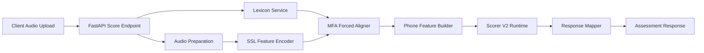
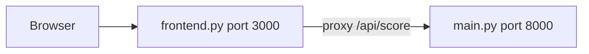
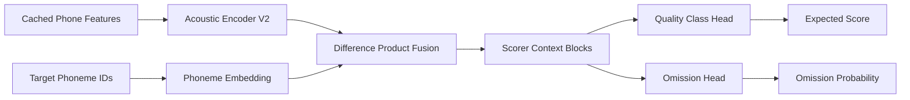
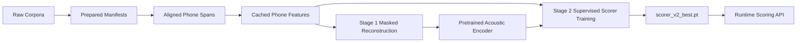
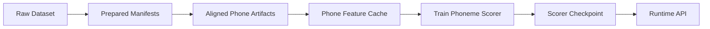

# Design and Implementation of a Word-Level Pronunciation Assessment Backend Using Forced Alignment and Self-Supervised Speech Features

**Project report structure for the Speech Quality Analysis repository**

Target length: 10–15 pages when exported to PDF or Word. This document is the canonical outline and writing guide; fill narrative prose and figures as you finalize the submission.

---

## Table of Contents

1. [Abstract](#1-abstract)
2. [Introduction](#2-introduction)
3. [Background and Related Concepts](#3-background-and-related-concepts)
4. [Requirements and Scope](#4-requirements-and-scope)
5. [System Architecture](#5-system-architecture)
6. [Runtime Pronunciation Assessment Pipeline](#6-runtime-pronunciation-assessment-pipeline)
7. [Trained Model Architecture](#7-trained-model-architecture)
8. [Two-Stage Model Training Process](#8-two-stage-model-training-process)
9. [Data and Feature Pipeline](#9-data-and-feature-pipeline)
10. [API Design and User Interaction](#10-api-design-and-user-interaction)
11. [Evaluation and Testing](#11-evaluation-and-testing)
12. [Deployment and Runtime Configuration](#12-deployment-and-runtime-configuration)
13. [Limitations and Future Work](#13-limitations-and-future-work)
14. [Conclusion](#14-conclusion)
15. [Appendices](#15-appendices)

---

## 1. Abstract

<!-- ~0.5 page -->

This project implements a backend MVP for **American English word-level pronunciation assessment**. Given a known target word and a learner audio recording, the system returns phoneme-level scores, one primary correction target, IPA transcription, and optional reference-audio metadata. Runtime scoring follows an align-based pipeline: lexicon lookup, audio preparation, frozen self-supervised speech encoding (HuBERT-style), Montreal Forced Aligner (MFA) phoneme alignment, phone-level feature pooling, and inference with a trained **scorer v2** neural model. Training is intentionally decoupled from inference: datasets move through `raw → prepared → aligned → features`, a contextual acoustic encoder is optionally pretrained with masked reconstruction, and a supervised phoneme scorer is trained on cached phone-level artifacts. The repository ships a FastAPI backend, optional debug frontend, documented API contract, offline eval scripts, and a pytest suite covering API, pipeline, alignment, and training utilities.

**Primary sources:** [README.md](../README.md), [docs/api_contract.md](api_contract.md)

---

## 2. Introduction

<!-- ~1 page -->

### 2.1 Problem and motivation

Automated pronunciation feedback helps language learners practice outside the classroom. Full utterance or conversational assessment is complex; **word-level** assessment with a **known target word** is a practical MVP that still delivers actionable phoneme-level diagnostics.

### 2.2 Project goal

Build a backend that:

- Accepts a target word and mono audio upload.
- Aligns speech to canonical phonemes.
- Scores each phoneme and surfaces the single most important issue.
- Returns structured JSON suitable for clients or a debug UI.

### 2.3 Scope boundaries

From [README.md](../README.md):

| In scope | Out of scope (MVP) |
|----------|-------------------|
| Single-word assessment | Sentence-level or open ASR |
| Known target word in advance | Unknown transcript |
| `en-US` canonical pronunciation | Multi-accent or multilingual |
| Phoneme-level scoring | Speaker personalization (`speaker_id` reserved) |
| One primary issue in response | Full tutoring dialogue |

### 2.4 Contributions

1. **Runtime scoring API** — FastAPI service with health and score endpoints ([main.py](../src/pronunciation_backend/main.py)).
2. **Modular pipeline** — Lexicon, audio prep, SSL encoder, MFA aligner, feature builder, scorer, response mapper ([pipeline.py](../src/pronunciation_backend/services/pipeline.py)).
3. **Trained phoneme scorer** — `PhonemeScorerModelV2` with optional two-stage training ([scorer_model_v2.py](../src/pronunciation_backend/training/scorer_model_v2.py)).
4. **Offline data and training pipeline** — Dataset ingestion, feature precompute, pretraining, supervised training ([docs/dataset_ingestion.md](dataset_ingestion.md), [docs/feature_precompute_pipeline.md](feature_precompute_pipeline.md)).
5. **Evaluation tooling** — Offline checkpoint eval and historical MFA latency notes ([eval_scorer_v2_checkpoint.py](../src/pronunciation_backend/training/eval_scorer_v2_checkpoint.py); see §11.4).

---

## 3. Background and Related Concepts

<!-- ~1–1.5 pages -->

### 3.1 Pronunciation assessment and GOP-style scoring

**Goodness of Pronunciation (GOP)** methods score how well observed acoustics match expected phoneme targets. This project uses forced alignment to obtain phoneme boundaries, pools SSL frame embeddings per phoneme, and applies a learned scorer rather than classic GOP log-posterior ratios.

### 3.2 Phonemes, IPA, and lexicon

- **ARPABET** phones from CMUdict supply canonical pronunciations at runtime.
- **IPA** is returned in API responses for display.
- Curated overrides in [en_us_words.json](../src/pronunciation_backend/resources/en_us_words.json) add reference audio and enriched metadata for a starter word set.

### 3.3 Forced alignment (MFA)

**Montreal Forced Aligner** aligns audio to a known transcript using acoustic models and a pronunciation dictionary. At runtime, MFA runs as an **external subprocess** per request ([mfa_aligner.py](../src/pronunciation_backend/services/mfa_aligner.py)). Offline, MFA TextGrids feed aligned training artifacts ([docs/dataset_ingestion.md](dataset_ingestion.md)).

### 3.4 Self-supervised speech encoders

**HuBERT** / **Wav2Vec2** provide frame-level representations without phoneme labels. Here the backbone is **frozen** at inference and during feature precompute; only pooled phone embeddings feed the trainable scorer ([feature_encoder.py](../src/pronunciation_backend/services/feature_encoder.py)).

### 3.5 Multi-task phoneme outputs

The v2 scorer predicts:

- **Quality class** — `wrong_or_missed`, `accented`, `correct`
- **Expected score** — 0–100 scale derived from class probabilities
- **Omission probability** — separate binary head

See [docs/scorer_architecture.md](scorer_architecture.md) and [docs/scoring_head.md](scoring_head.md) for design rationale.

---

## 4. Requirements and Scope

<!-- ~1 page -->

### 4.1 Functional requirements

| ID | Requirement | Implementation |
|----|-------------|----------------|
| FR-1 | Accept `word` + `audio` via HTTP | `POST /v1/pronunciation/score` ([main.py](../src/pronunciation_backend/main.py)) |
| FR-2 | Validate audio (format, duration, quality) | [audio_prep.py](../src/pronunciation_backend/services/audio_prep.py) |
| FR-3 | Resolve canonical pronunciation | [lexicon.py](../src/pronunciation_backend/services/lexicon.py) + CMUdict |
| FR-4 | Align phonemes to audio | [mfa_aligner.py](../src/pronunciation_backend/services/mfa_aligner.py) |
| FR-5 | Score each phoneme; return overall score | [scorer_v2_runtime.py](../src/pronunciation_backend/services/scorer_v2_runtime.py), [response_mapper.py](../src/pronunciation_backend/services/response_mapper.py) |
| FR-6 | Return IPA, reference metadata, primary issue | [models.py](../src/pronunciation_backend/models.py), [api_contract.md](api_contract.md) |
| FR-7 | Optional skip of backend auto-trim | `noTrim` form field |

### 4.2 Non-functional requirements

| ID | Requirement | Notes |
|----|-------------|-------|
| NFR-1 | Configurable via environment | [config.py](../src/pronunciation_backend/config.py) |
| NFR-2 | Clear HTTP errors | `400` bad audio, `404` unknown word, `503` alignment failure |
| NFR-3 | Reproducible training artifacts | Hashed feature store, staged datasets ([feature_precompute_pipeline.md](feature_precompute_pipeline.md)) |
| NFR-4 | Interactive latency | MFA alignment dominates (~16 s per request); see [mfa_alignment_experiments.md](mfa_alignment_experiments.md) |

---

## 5. System Architecture

<!-- ~2 pages -->

The backend is a **service-oriented pipeline** wired at application startup. There is no separate SPA frontend; a lightweight FastAPI debug UI proxies to the backend ([frontend.py](../src/pronunciation_backend/frontend.py)).

### 5.1 Component overview

| Component | Path | Role |
|-----------|------|------|
| FastAPI app | [main.py](../src/pronunciation_backend/main.py) | HTTP entry, lifespan, error mapping |
| Pipeline orchestrator | [pipeline.py](../src/pronunciation_backend/services/pipeline.py) | `assess_word()` coordinates all stages |
| Domain models | [models.py](../src/pronunciation_backend/models.py) | API schemas + internal dataclasses |
| Lexicon | [lexicon.py](../src/pronunciation_backend/services/lexicon.py) | CMUdict + curated overrides |
| Audio prep | [audio_prep.py](../src/pronunciation_backend/services/audio_prep.py) | Decode, trim, quality metrics |
| SSL encoder | [feature_encoder.py](../src/pronunciation_backend/services/feature_encoder.py) | Frozen HuBERT frames |
| MFA aligner | [mfa_aligner.py](../src/pronunciation_backend/services/mfa_aligner.py) | Subprocess alignment → `PhoneSpan` |
| Feature builder | [aligner.py](../src/pronunciation_backend/services/aligner.py) | Pool frames → `PhoneFeatures` |
| Scorer runtime | [scorer_v2_runtime.py](../src/pronunciation_backend/services/scorer_v2_runtime.py) | Load checkpoint, infer |
| Response mapper | [response_mapper.py](../src/pronunciation_backend/services/response_mapper.py) | API payload + primary issue |

### 5.2 Runtime architecture diagram



### 5.3 Debug frontend (optional)



The frontend avoids browser CORS to a remote GPU server and supports manual trim + `noTrim` ([README.md](../README.md)).

### 5.4 Design decisions

1. **Inference vs training split** — Runtime encodes live audio; training uses cached phone rows ([training_artifacts.md](training_artifacts.md)).
2. **MFA external to Python env** — Avoids conda/uv conflicts ([pyproject.toml](../pyproject.toml)).
3. **CMUdict as vocabulary source** — Curated JSON enriches reference audio only ([README.md](../README.md)).
4. **Scorer v2 only at runtime** — `Settings.validate_runtime()` requires `scorer_v2`, MFA, HF encoder, checkpoint path ([config.py](../src/pronunciation_backend/config.py)).

---

## 6. Runtime Pronunciation Assessment Pipeline

<!-- ~2 pages -->

Central flow in `PronunciationPipeline.assess_word()`:

```python
entry = self.lexicon_service.get_word(word)
prepared = self.audio_prep_service.decode(audio_bytes, enable_trim=not no_trim)
encoded = self.feature_encoder.encode(prepared)
spans = self.aligner.align(entry, prepared, encoded)
phone_features = self.feature_builder.build(encoded, spans)
runtime_result = self.scorer_runtime.score(phone_features)
return self.response_mapper.build_response(...)
```

Source: [pipeline.py](../src/pronunciation_backend/services/pipeline.py)

### 6.1 Lexicon lookup

- Normalizes word token; looks up CMUdict phones and IPA.
- Curated entries may attach `reference_audio_id`.
- Unknown words → `UnknownWordError` → HTTP 404.

**Evidence:** [lexicon.py](../src/pronunciation_backend/services/lexicon.py), [tests/test_lexicon.py](../tests/test_lexicon.py)

### 6.2 Audio preparation

- Decode with `soundfile`; mono; resample to 16 kHz; peak normalize.
- Duration gate: 250–4000 ms ([config.py](../src/pronunciation_backend/config.py)).
- Optional **auto-trim** via RMS energy islands ([audio_prep.py](../src/pronunciation_backend/services/audio_prep.py)).
- Quality metrics: SNR estimate, RMS, clipping ratio, silence ratio → `ok` / `low_confidence` / `rejected`.

**Evidence:** [tests/test_audio_prep.py](../tests/test_audio_prep.py), trim semantics in [api_contract.md](api_contract.md)

### 6.3 SSL feature encoding

- Default backbone: `facebook/hubert-base-ls960`.
- Outputs frame embeddings (768-d), frame_ms, per-frame energy.
- Requires `PRONUNCIATION_USE_HF_ENCODER=1` for scorer v2 serving.

**Evidence:** [feature_encoder.py](../src/pronunciation_backend/services/feature_encoder.py)

### 6.4 MFA forced alignment

- Writes temp WAV, `.lab`, per-request dictionary; invokes `mfa align --clean`.
- Parses TextGrid word/phone tiers; validates phone sequence against canonical lexicon.
- Maps intervals to frame indices and `PhoneSpan` objects with duration z-scores.

**Evidence:** [mfa_aligner.py](../src/pronunciation_backend/services/mfa_aligner.py), [tests/test_mfa_aligner.py](../tests/test_mfa_aligner.py)

### 6.5 Phone feature construction

Per phoneme: mean embedding, variance, duration_ms, duration_z_score, alignment_confidence, energy_mean, `starts_late`.

**Evidence:** [aligner.py](../src/pronunciation_backend/services/aligner.py)

### 6.6 Scorer inference and response mapping

- [tensor_mapper.py](../src/pronunciation_backend/services/tensor_mapper.py) builds batch tensors from runtime `PhoneFeatures`.
- [scorer_v2_runtime.py](../src/pronunciation_backend/services/scorer_v2_runtime.py) loads checkpoint, runs `PhonemeScorerModelV2`.
- [response_mapper.py](../src/pronunciation_backend/services/response_mapper.py) computes overall score, confidence, primary issue; shifts phoneme times by trim offset.

**Evidence:** [tests/test_pipeline.py](../tests/test_pipeline.py), [tests/test_scorer_v2_runtime.py](../tests/test_scorer_v2_runtime.py)

---

## 7. Trained Model Architecture

<!-- ~2–2.5 pages -->

The runtime model is **not** an end-to-end audio classifier. It is a **phone-sequence scorer** over cached, aligned, pooled acoustic features plus target phoneme identities.

### 7.1 Input representation

| Field | Training (`PhoneEmbeddingArtifact`) | Runtime (`PhoneFeatures`) |
|-------|-------------------------------------|---------------------------|
| Acoustic vector | `mean_embedding` (768-d) | Same, from live HuBERT pooling |
| Phoneme identity | Row metadata + `phoneme` | `phoneme` → id via [dataset.py](../src/pronunciation_backend/training/dataset.py) |
| Sequence structure | Word-grouped batches | Single word, length = phone count |
| Auxiliary stats | variance, duration, energy, alignment_confidence | Same |

Schema: [schemas.py](../src/pronunciation_backend/training/schemas.py)

### 7.2 AcousticEncoderV2

Stack applied to the sequence of 768-d phone embeddings:

| Hyperparameter | Default |
|----------------|---------|
| `input_dim` | 768 |
| `d_model` | 384 |
| `num_heads` | 6 |
| `num_layers` (acoustic) | 6 |
| `ffn_dim` | 1536 |
| `dropout` | 0.05 |
| Positional encoding | RoPE (`rope_base=10000`) |
| FFN | SwiGLU |
| Normalization | RMSNorm (optional sandwich in v3) |

Each **AcousticEncoderBlock** uses multi-head self-attention with optional QK norm, masked padding, and pre-norm or parallel pre-norm layout depending on `architecture_version` (`v2_compat` vs `v3`).

**Evidence:** [acoustic_encoder_v2.py](../src/pronunciation_backend/training/acoustic_encoder_v2.py), [tests/test_acoustic_encoder_v2.py](../tests/test_acoustic_encoder_v2.py)

### 7.3 PhonemeScorerModelV2

After acoustic encoding:

1. **Phoneme embedding** — `nn.Embedding(42, 48)` → linear projection to `d_model`.
2. **Fusion** — Concatenate `[acoustic, phoneme, acoustic − phoneme, acoustic ⊙ phoneme]` (4 × d_model) → linear → d_model.
3. **Scorer blocks** — 2 × `AcousticEncoderBlock` for within-word context.
4. **Heads:**
   - `quality_head` → 3 logits
   - `omission_head` → 1 logit

**Expected scores** are derived from softmax class probabilities and fixed anchors ([scoring_targets.py](../src/pronunciation_backend/training/scoring_targets.py)):

| Class | Target score (0–100) | Human score (0–2) |
|-------|----------------------|-------------------|
| `wrong_or_missed` | 15 | 0 |
| `accented` | 60 | 1 |
| `correct` | 92 | 2 |

```python
expected_score = class_probs @ [15, 60, 92]
```

There is **no separate regression head** in v2; score granularity depends on calibrated class probabilities.

**Evidence:** [scorer_model_v2.py](../src/pronunciation_backend/training/scorer_model_v2.py), [tests/test_scorer_model_v2.py](../tests/test_scorer_model_v2.py)

### 7.4 Model architecture diagram



### 7.5 Runtime checkpoint loading

`ScorerV2Runtime`:

- Loads `scorer_v2_best.pt` (or configured path).
- Reconstructs model from checkpoint `config` via `scorer_model_kwargs_from_config`.
- Maps `PhoneFeatures` → tensors; runs inference; builds `ScorerPhonePrediction` list.

**Evidence:** [scorer_v2_runtime.py](../src/pronunciation_backend/services/scorer_v2_runtime.py)

### 7.6 Relation to v1 design doc

[docs/scorer_architecture.md](scorer_architecture.md) describes an earlier 804-d MLP + 2-layer Transformer baseline. The implemented v2 model uses the **AcousticEncoderV2 + fusion + scorer blocks** design above; cite both when discussing design evolution.

---

## 8. Two-Stage Model Training Process

<!-- ~2 pages -->

Training is a **staged pipeline**, not a single end-to-end run from raw waveforms.

### 8.1 Stage 0: Data and feature preparation



| Step | Output | Tooling |
|------|--------|---------|
| Download / import | `raw/` | [ingest_datasets.py](../src/pronunciation_backend/training/ingest_datasets.py) |
| Prepare | `prepared/*.jsonl` | `prepare_libritts`, `prepare_speechocean762` |
| Align | `aligned/*.jsonl` | `build_*_aligned`, MFA scripts |
| Feature precompute | hashed feature store | [precompute_features.py](../src/pronunciation_backend/training/precompute_features.py) |

Recommended dataset mix ([training_artifacts.md](training_artifacts.md)):

- **SpeechOcean762** — supervised phoneme-quality labels (learner speech).
- **LibriTTS** — native reference, duration priors, pretraining features.

### 8.2 Stage 1: Acoustic encoder pretraining

**Script:** [pretrain_acoustic_encoder_v2.py](../src/pronunciation_backend/training/pretrain_acoustic_encoder_v2.py)

**Task:** Masked phone-feature reconstruction on clean cached features (typically LibriTTS train split).

| Setting | Default |
|---------|---------|
| `mask_ratio` | 0.20 |
| `mask_block_size` | 2 |
| `min_masks` | 1 |
| Loss | MSE on masked positions only |
| Optimizer | Muon (2D weights) + Adam-style aux (biases, head) |
| `muon_lr` / `aux_lr` | 0.02 / 3e-4 |
| `batch_size` | 256 |
| `epochs` | 10 |

**Model:** `AcousticEncoderPretrainModel` = `AcousticEncoderV2` + linear reconstruction head to 768-d.

**Output:** `acoustic_encoder_v2_best.pt` (lowest validation reconstruction loss).

**Evidence:** [tests/test_pretrain_acoustic_encoder_v2.py](../tests/test_pretrain_acoustic_encoder_v2.py)

### 8.3 Stage 2: Supervised scorer training

**Script:** [train_scorer_v2.py](../src/pronunciation_backend/training/train_scorer_v2.py)

| Setting | Default |
|---------|---------|
| `--encoder-checkpoint-path` | Optional Stage 1 weights |
| `--freeze-encoder-epochs` | 2 (encoder frozen initially) |
| `--encoder-lr-scale` | 0.2 |
| `lr` | 3e-4 |
| Optimizer | AdamW (separate LR groups for encoder vs heads) |
| `omission_loss_weight` | 0.25 |
| Class loss | Weighted cross-entropy (weights from train set) |
| Omission loss | BCE with logits |
| Best checkpoint criterion | Lowest validation **quality_loss** |

**Training objective:**

```
L = L_quality + 0.25 × L_omission
```

Score MAE is logged against regression targets derived from match targets but is not a separate loss term.

**Output:** `scorer_v2_best.pt` — deployed via `PRONUNCIATION_SCORER_CHECKPOINT_PATH`.

**Evidence:** [tests/test_train_scorer_v2.py](../tests/test_train_scorer_v2.py)

### 8.4 Label and split policy

- Speaker-disjoint `train / val / test` ([training_artifacts.md](training_artifacts.md)).
- SpeechOcean762-style human scores 0/1/2 map to classes and regression targets 15/60/92.
- Native LibriTTS rows support pretraining and false-positive checks; real error supervision comes from learner corpora.

---

## 9. Data and Feature Pipeline

<!-- ~1 page -->

### 9.1 Canonical layout

```text
/cold/pronunciation/datasets/<dataset>/
  raw/
  prepared/
  aligned/
  reports/

/cold/pronunciation/features/<dataset>/<feature_key>/
  spec.json
  state.json
  splits/train|val|test/part-*.jsonl
```

**Evidence:** [dataset_ingestion.md](dataset_ingestion.md), [feature_precompute_pipeline.md](feature_precompute_pipeline.md)

### 9.2 Feature key hashing

The feature-store directory name is a deterministic hash of backbone id, alignment source, pooling version, sample rate, schema version, etc. Changing any spec component creates a **new cache namespace** without silent mixing.

### 9.3 Primary schemas

| Schema | Purpose |
|--------|---------|
| `PreparedUtteranceArtifact` | Normalized utterance manifest |
| `TrainingUtteranceArtifact` | Aligned word + `phone_labels` |
| `PhoneEmbeddingArtifact` | One trainable row per phoneme |

**Evidence:** [schemas.py](../src/pronunciation_backend/training/schemas.py), [tests/test_verify_precomputed_features.py](../tests/test_verify_precomputed_features.py)

### 9.4 Data pipeline diagram



### 9.5 Dataset support matrix

| Dataset | Download | Prepare | Align | Features |
|---------|----------|---------|-------|----------|
| LibriTTS | Yes | Yes | Yes (TextGrid + CMUdict) | Yes |
| SpeechOcean762 | Yes | Yes | Yes (with TextGrid root) | Yes |
| L2-ARCTIC | Import only | Partial | No | After align |
| LibriSpeech | Import only | Partial | No | After align |

**Evidence:** [dataset_ingestion.md](dataset_ingestion.md)

---

## 10. API Design and User Interaction

<!-- ~1 page -->

### 10.1 Endpoint

`POST /v1/pronunciation/score` — multipart form:

| Field | Required | Description |
|-------|----------|-------------|
| `word` | Yes | Target word (CMUdict-backed) |
| `audio` | Yes | Mono recording |
| `speaker_id` | No | Reserved |
| `noTrim` | No | Skip backend auto-trim |

### 10.2 Response highlights

- `overall_score`, `confidence`
- `audio_quality` (trim metadata, SNR, duration)
- `phonemes[]` — per-phoneme class, scores, omission probability, alignment confidence
- `primary_issue` — worst phoneme + message
- `reference` — optional curated reference audio
- `model_info` — checkpoint, backbone, device

Full example: [api_contract.md](api_contract.md)

### 10.3 Error codes

| Code | Cause |
|------|-------|
| 400 | Empty/invalid/too short/too long audio |
| 404 | Unknown or empty word token |
| 503 | MFA unavailable, timeout, or alignment failure |

**Evidence:** [tests/test_api.py](../tests/test_api.py)

### 10.4 Debug frontend

```bash
python -m pronunciation_backend.frontend --backend-url http://host:8000 --port 3000
```

Supports recording, optional manual trim, and `noTrim` forwarding ([frontend.py](../src/pronunciation_backend/frontend.py), [tests/test_frontend.py](../tests/test_frontend.py)).

---

## 11. Evaluation and Testing

<!-- ~1.5–2 pages -->

This section **separates what the repository already validates** from **what you must measure externally** before claiming model quality.

### 11.1 Software validation (in repository)

**Test suite:** ~28 modules under [tests/](../tests/) (API, pipeline, audio, lexicon, MFA mocks, scorer, training utilities).

| Layer | Test files | What is verified |
|-------|------------|------------------|
| API contract | [test_api.py](../tests/test_api.py) | Health, score, errors, `noTrim`, null reference |
| Pipeline | [test_pipeline.py](../tests/test_pipeline.py) | Stage wiring, reference omission, trim offset |
| Runtime config | [test_config_runtime.py](../tests/test_config_runtime.py) | Checkpoint path, MFA backend, HF encoder |
| MFA aligner | [test_mfa_aligner.py](../tests/test_mfa_aligner.py) | Subprocess mocks, TextGrid parsing, timeouts |
| Scorer model | [test_scorer_model_v2.py](../tests/test_scorer_model_v2.py) | Forward shapes, score-from-probs |
| Pretrain | [test_pretrain_acoustic_encoder_v2.py](../tests/test_pretrain_acoustic_encoder_v2.py) | Masking, Muon groups, reconstruction loss |
| Eval logic | [test_eval_scorer_v2_checkpoint.py](../tests/test_eval_scorer_v2_checkpoint.py) | Confusion summary, collapse diagnostics |
| Data ingest | [test_ingest_datasets.py](../tests/test_ingest_datasets.py) | Layout, scaffolding, retries |

**Important limitation:** Tests use **mocked** MFA, encoder, and scorer in API/pipeline paths. There is **no CI workflow** and **no full GPU end-to-end test** in git.

### 11.2 Model evaluation (external artifacts required)

**Tool:** [eval_scorer_v2_checkpoint.py](../src/pronunciation_backend/training/eval_scorer_v2_checkpoint.py)

Run on a held-out feature split with a trained checkpoint:

```bash
python -m pronunciation_backend.training.eval_scorer_v2_checkpoint \
  --features-dir /cold/.../splits/test \
  --checkpoint-path /cold/.../scorer_v2_best.pt \
  --report-path /cold/.../eval_report.json
```

**Metrics emitted (implemented):**

| Metric | Description |
|--------|-------------|
| `class_accuracy` | Argmax class vs target |
| `class_confusion_rates` | 3×3 confusion matrix |
| `score_mae`, `score_rmse` | Expected score vs regression target |
| `score_pearson` | Linear correlation |
| `omission_accuracy` | Thresholded omission head |
| Collapse flags | e.g. `degenerate_all_correct_predictions` |

**Metrics documented but not fully implemented in eval scripts:**

| Metric | Source doc | Status |
|--------|------------|--------|
| Macro F1 | [scoring_head.md](scoring_head.md) | Use confusion matrix manually |
| Spearman on match score | [scoring_head.md](scoring_head.md) | Pearson implemented instead |
| Native false-positive rate | [scoring_head.md](scoring_head.md) | Requires LibriTTS holdout run |
| Calibration error | [scoring_head.md](scoring_head.md) | Not automated |

### 11.3 Acoustic pretraining evaluation (external)

Report from Stage 1 logs or checkpoint metadata:

- Train/validation **reconstruction loss**
- Masked token counts per epoch
- Ablation: supervised val quality loss **with vs without** `--encoder-checkpoint-path`

No committed pretraining curves exist in the repository.

### 11.4 Runtime performance evaluation

#### Documented MFA benchmarks (historical notes)

Historical latency notes were captured in an internal `mfa_alignment_experiments.md` document and shell benchmarks that are **not included in this repository**. Approximate figures from those notes:

| Scenario | Approximate latency |
|----------|---------------------|
| Backend scoring (alignment subprocess) | ~16.2 s |
| Isolated MFA `align --clean` | ~16.9 s |
| Isolated MFA `align --no_clean` (reused workspace) | ~9.1 s |

To reproduce benchmarks today, run MFA and backend scoring manually on your deployment host; there are no committed `scripts/benchmark_*.sh` helpers in git.

#### Recommended future runtime metrics

| Metric | How to obtain |
|--------|---------------|
| End-to-end request latency | Benchmark JSON from remote GPU script |
| Encoder latency | Stage timing in pipeline (not yet exported) |
| Alignment failure rate | Production logs / benchmark repetitions |
| p95 latency under load | Load test (not in repo) |

**No committed benchmark JSON or result plots** are stored in git.

### 11.5 Evaluation summary table

| Category | Available today | Requires external run |
|----------|-----------------|------------------------|
| Unit/component tests | pytest suite | — |
| API contract | test_api + api_contract.md | — |
| Model accuracy / MAE | eval script exists | Checkpoint + test features on `/cold` |
| Pretrain quality | train script logs | acoustic_encoder_v2_best.pt |
| MFA latency | Historical notes (§11.4) | Manual timing on deployment host |
| E2E live scoring | Manual via frontend | GPU server + MFA + checkpoint |

---

## 12. Deployment and Runtime Configuration

<!-- ~1 page -->

### 12.1 Dependencies

From [pyproject.toml](../pyproject.toml):

- Python ≥ 3.11
- FastAPI, uvicorn, soundfile, cmudict, torch, transformers
- Dev: pytest, httpx, pyarrow
- **MFA not in pip deps** — separate micromamba/conda env

### 12.2 Serving the backend

```bash
uv sync --group dev
export PRONUNCIATION_USE_HF_ENCODER=1
export PRONUNCIATION_SCORER_CHECKPOINT_PATH=/path/to/scorer_v2_best.pt
export PRONUNCIATION_SCORER_DEVICE=cuda
export PRONUNCIATION_MFA_COMMAND="/opt/micromamba/bin/micromamba run -n mfa mfa"
export PRONUNCIATION_MFA_ACOUSTIC_MODEL=english_us_arpa
uv run uvicorn pronunciation_backend.main:app --host 0.0.0.0 --port 8000
```

### 12.3 Key environment variables

| Variable | Purpose |
|----------|---------|
| `PRONUNCIATION_SCORER_CHECKPOINT_PATH` | Required scorer weights |
| `PRONUNCIATION_USE_HF_ENCODER` | Must be `1` for v2 |
| `PRONUNCIATION_MFA_COMMAND` | MFA launcher |
| `PRONUNCIATION_MFA_ACOUSTIC_MODEL` | MFA acoustic model name |
| `PRONUNCIATION_MFA_WORK_ROOT` | Temp alignment workspaces |
| `PRONUNCIATION_STORAGE_ROOT` | Datasets, features, checkpoints |
| `HF_HOME` | Hugging Face cache |
| `PRONUNCIATION_CMUDICT_PATH` | Optional pinned CMUdict |

Full list: [config.py](../src/pronunciation_backend/config.py)

### 12.4 Storage layout (Linux server)

Default roots under `/cold/pronunciation/` for datasets, features, checkpoints, reports. Windows dev requires overriding paths via environment.

---

## 13. Limitations and Future Work

<!-- ~1 page -->

1. **Product scope** — Single known word, `en-US` only; no sentence-level assessment.
2. **MFA latency** — Subprocess alignment dominates request time (~16 s); interactive UX needs persistent worker or in-process aligner (see historical MFA benchmark notes in §11.4).
3. **External artifacts** — Datasets, checkpoints, and eval JSON are not versioned in git; results depend on `/cold` storage.
4. **Score granularity** — v2 expected score is a probability-weighted blend of three anchors (15/60/92), not fine-grained regression.
5. **Dataset coverage** — L2-ARCTIC and LibriSpeech import-only; SpeechOcean762 primary learner supervision (Mandarin L1 bias).
6. **Reference audio** — Small curated set; most CMUdict words return `reference: null` ([resources.md](resources.md)).
7. **Testing gaps** — No CI, no production E2E test with real MFA + GPU + checkpoint.
8. **Benchmark scripts** — `scripts/benchmark_mfa_cli.sh`, `scripts/benchmark_remote_gpu.sh`, and `mfa_alignment_experiments.md` are not in this repository; latency numbers in §11.4 are historical notes only.

**Future work:** Persistent MFA service, CTC/in-process aligner, parquet feature pipeline, speaker adaptation, broader reference library, F1/Spearman/calibration in eval, multi-accent support.

---

## 14. Conclusion

<!-- ~0.5 page -->

This repository delivers a **coherent MVP** for phoneme-level pronunciation assessment: a modular FastAPI backend, MFA-based alignment, frozen SSL features at inference, a trainable contextual phoneme scorer with optional two-stage training, and documented data/eval tooling. The architecture cleanly separates **runtime inference** from **offline artifact generation**, enabling fast scorer iteration without re-encoding audio every epoch. Empirical claims about pronunciation quality and production latency require running the documented training and eval pipelines on external GPU storage; the codebase provides the methodology, contracts, and tests to support those claims honestly.

---

## 15. Appendices

### Appendix A: Example API response (abbreviated)

See full JSON in [api_contract.md](api_contract.md).

### Appendix B: Scorer v2 default hyperparameters

| Parameter | Value |
|-----------|-------|
| `acoustic_input_dim` | 768 |
| `d_model` | 384 |
| `num_heads` | 6 |
| `acoustic_layers` | 6 |
| `scorer_layers` | 2 |
| `ffn_dim` | 1536 |
| `phoneme_vocab_size` | 42 |
| `phoneme_embed_dim` | 48 |
| `dropout` | 0.05 |
| `batch_size` (train) | 128 |
| `epochs` (train) | 10 |
| `freeze_encoder_epochs` | 2 |
| `encoder_lr_scale` | 0.2 |
| `omission_loss_weight` | 0.25 |

Source: [train_scorer_v2.py](../src/pronunciation_backend/training/train_scorer_v2.py)

### Appendix C: Acoustic pretrain default hyperparameters

| Parameter | Value |
|-----------|-------|
| `mask_ratio` | 0.20 |
| `mask_block_size` | 2 |
| `batch_size` | 256 |
| `epochs` | 10 |
| `muon_lr` / `aux_lr` | 0.02 / 3e-4 |
| `d_model` / layers / heads | 384 / 6 / 6 |

Source: [pretrain_acoustic_encoder_v2.py](../src/pronunciation_backend/training/pretrain_acoustic_encoder_v2.py)

### Appendix D: Class target mapping

| Human score | Class | Regression target |
|-------------|-------|-------------------|
| 0.0 | wrong_or_missed | 15 |
| 1.0 | accented | 60 |
| 2.0 | correct | 92 |

Source: [scoring_targets.py](../src/pronunciation_backend/training/scoring_targets.py)

### Appendix E: Test inventory (by area)

| Area | Files |
|------|-------|
| API | test_api.py |
| Pipeline | test_pipeline.py |
| Audio | test_audio_prep.py |
| Lexicon | test_lexicon.py |
| MFA | test_mfa_aligner.py |
| Scorer runtime | test_scorer_v2_runtime.py |
| Scorer model | test_scorer_model_v2.py, test_acoustic_encoder_v2.py |
| Pretrain | test_pretrain_acoustic_encoder_v2.py |
| Train v2 | test_train_scorer_v2.py |
| Eval | test_eval_scorer_v2_checkpoint.py |
| Ingest / features | test_ingest_datasets.py, test_training_speechocean762.py, test_verify_precomputed_features.py, test_training_mmap_dataset.py |
| Frontend | test_frontend.py |

### Appendix F: MFA benchmark commands

Historical benchmark commands lived in deployment-only scripts and notes that are not shipped in this repository. See §11.4 for approximate latency figures and run MFA/backend timing manually on your host to reproduce.

---

## Suggested figures for final submission

| Figure | Content | Source section |
|--------|---------|----------------|
| Fig. 1 | Runtime pipeline diagram | §5.2 |
| Fig. 2 | Model architecture diagram | §7.4 |
| Fig. 3 | Two-stage training pipeline | §8.1 |
| Fig. 4 | Data artifact flow | §9.4 |
| Fig. 5 | API response screenshot / JSON | §10, Appendix A |
| Fig. 6 | Confusion matrix (from eval JSON) | §11.2 |
| Fig. 7 | Latency breakdown bar chart | §11.4 |
| Fig. 8 | Debug frontend screenshot | §10.4 |

---

## Writing order (recommended)

1. Sections 4–7 — requirements, architecture, runtime, model (code-grounded).
2. Sections 8–10 — training, data, API.
3. Sections 11–12 — evaluation, deployment.
4. Sections 1–3 — abstract, intro, background (after technical core is stable).
5. Sections 13–15 — limitations, conclusion, appendices.

---

## Repository evidence index

| Topic | Primary files |
|-------|---------------|
| Scope | README.md |
| Runtime | main.py, pipeline.py, services/*.py |
| Model | acoustic_encoder_v2.py, scorer_model_v2.py, scorer_v2_runtime.py |
| Training | pretrain_acoustic_encoder_v2.py, train_scorer_v2.py, precompute_features.py |
| Data | dataset_ingestion.md, feature_precompute_pipeline.md, schemas.py |
| API | api_contract.md, models.py, test_api.py |
| Eval | eval_scorer_v2_checkpoint.py, tests/test_eval_scorer_v2_checkpoint.py |
| Benchmarks | §11.4 (historical notes; no benchmark scripts in repo) |
